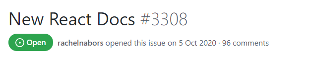
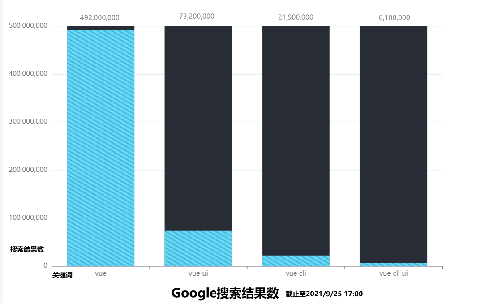
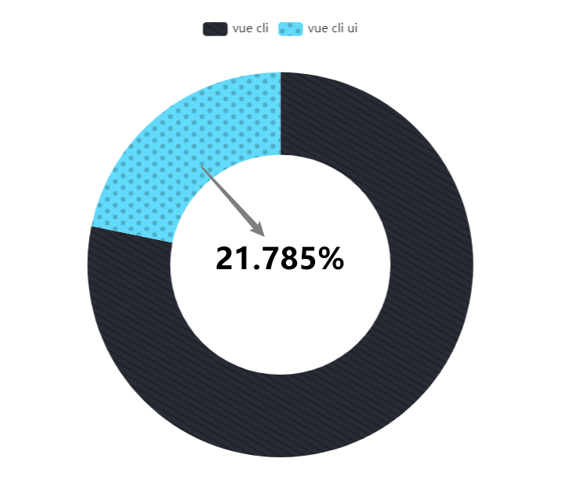
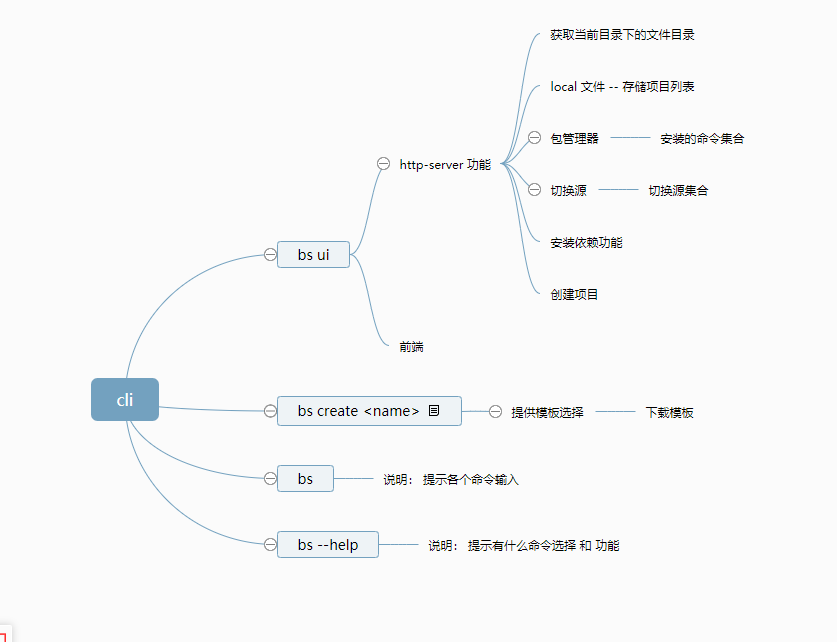
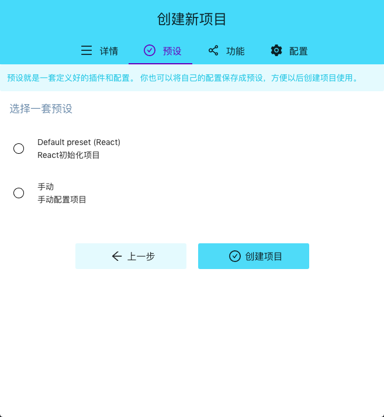
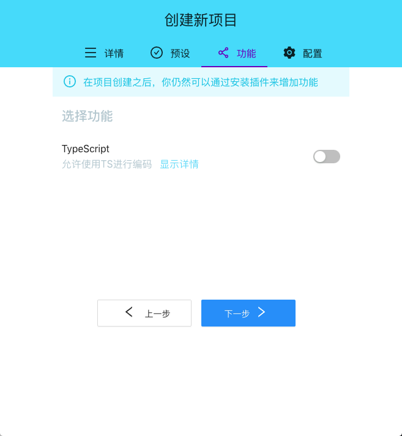

# 产品需求文档
## 一、概述
### 介绍
bytes-react-cli是一个基于React进行快速开发的完整系统，它提供：
- 通过`cli`实现的交互式的项目脚手架
- 一个运行时依赖`service`
- 一套完全图形化的创建和管理React项目的用户界面。
### 产品定位
针对具有视觉学习风格的人，为他们提供图形用户界面，增加搭建React项目的易用性。
### 用户需求
#### 需求背景
React对新人入门其实并不友好，官方文档也比较难懂，以至于核心团队自己都看不下去，在重写文档。[New React Docs #3308](https://github.com/reactjs/reactjs.org/issues/3308?from=from_parent_mindnote)

新的官方文档在致力于推动**Anyone can learn React**，他们希望所有背景的学习者都可以使用React。

基于方便新手开发者学习使用React和官方的改进趋势，我们的项目应运而生。

#### 竞品调研
我们对同为主流框架Vue进行了调研

|搜索关键词|vue|vue ui|vue cli|vue cli ui|
|:--:|:--:|:--:|:--:|:--:|
|搜索结果条数| 492,000,000 | 73,200,000 | 21,900,000 | 6,100,000 |

粗略地整理了一下条目数，目前还说明不了什么问题，因此我们排除了vue ui干扰项，观察vue cli ui在vue cli中的占比为多少。

我们看到，结果约为21.785%。也就是说，在关注vue cli的人群中，有至少5分之一的人关注了vue cli ui。

我们可以想象一下，计科班上50名同学接触了vue，有10名同学对Vue的管理项目用户界面感兴趣，而React却没有提供这样的选择，这无形就降低了React的留存率。

因此要想使React在主流框架中保持竞争力，我们的开发项目是非常有必要的。

除此之外，我们还关注到了[Umi](https://github.com/umijs/umi)，它的定位是可扩展的企业级前端应用框架。目前是蚂蚁金服的底层前端框架，已经很好地服务了蚂蚁金服的内部用户。但问题也在此，umi和antd绑定太严重，基本默认生成的就是antd的文件，不适合轻量的入门开发。

## 二、产品结构

## 三、产品设计

### Demo1：预设页面

用户场景：用户初始化项目

功能描述：选择【Default preset (React)】选项点击【创建项目】即可开始创建项目；选择【手动】选项点击【下一步】即进入功能页面进行新的选择

前置条件：在详情页面点击【下一步】

页面逻辑：
- 提供默认配置选项 - Default preset（React）且被选中时右侧按钮显示的是【创建项目】
- 提供手动配置项目选项 - 手动 且被选中时右侧按钮显示的是【下一步】 

### Demo2：功能页面

用户场景：用户需要手动选择项目依赖

功能描述：用户自定义添加依赖（目前暂时只支持TypeScript选项）

前置条件：在预设页面选择【手动】后，点击【创建项目】

页面逻辑：

- 点击开关按钮选择TypeScript依赖
- 点击下一步到【配置页面】

